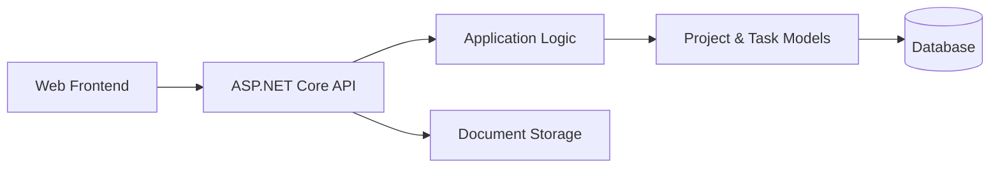

# ManagementApp — Full-Stack Project Management Platform

**ManagementApp** is a full-stack project management system built with a **.NET backend** and a **modern JavaScript frontend**.

The project demonstrates how to design a **business-oriented web application** that manages projects, tasks, documents, and workflows using a clean, scalable architecture.

This repository focuses on **backend domain modeling, API design, and full-stack integration**, rather than UI-only features.

---

## What This Project Is About

ProjectManagementApp is designed as a **classic business management platform**.

It demonstrates how to:
- model project and task domains
- implement CRUD-heavy business logic
- manage document uploads and persistence
- expose REST APIs for frontend clients
- structure a scalable full-stack application

The same architecture can be applied to:
- internal company tools
- task and workflow management systems
- admin dashboards
- SaaS-style business platforms

---

## Key Features

- Project and task management
- Document upload and storage
- RESTful API backend
- Full-stack separation (API + frontend)
- Persistent storage with migrations
- Ready-to-extend business logic

---

## High-Level Architecture



**Design principle:**  
Backend acts as the system of record; frontend is API-driven.

---

## Backend Overview (.NET)

The backend is implemented as an ASP.NET Core application.

### Responsibilities
- Project and task domain modeling
- Business rule enforcement
- File upload handling
- Database persistence
- API orchestration

### Structure

```
ProjectManagementApp/
  Controllers/     API endpoints
  Models/          Domain entities
  Data/            Database context
  Migrations/      Schema migrations
  UploadedDocuments/ File storage
```

This structure emphasizes:
- clarity
- maintainability
- scalability

---

## Frontend Overview

The frontend is a modern, JavaScript-based web application.

### Responsibilities
- User interaction and forms
- API communication
- State management
- UI rendering

### Tech Highlights
- Vite-based build system
- Modular frontend structure
- Environment-based configuration

---

## Technology Stack

### Backend
- **C#**
- **ASP.NET Core**
- **Entity Framework Core**
- **SQLite** (development database)
- **REST API**

### Frontend
- **JavaScript**
- **Vite**
- **Node.js**
- **npm**

### Architecture & Tooling
- Full-stack separation
- API-driven frontend
- Code-first migrations
- Local file storage

---

## Running the Project Locally

### Backend
```bash
cd ProjectManagementApp
dotnet restore
dotnet run
```

### Frontend
```bash
cd frontend
npm install
npm run dev
```

---

## Design Principles

- Business-domain-driven design
- Explicit data models
- Clear API boundaries
- Separation of concerns
- Extensible architecture

---

## What This Project Demonstrates

- Full-stack application development
- Business domain modeling
- REST API design
- File upload and persistence
- Scalable project structuring

---

## Final Notes

ProjectManagementApp is designed as a **realistic business application case**.

The focus is on:
- correctness of domain logic
- clean backend architecture
- reliable frontend-backend integration

It provides a solid foundation for extending into a production-ready project management system.

